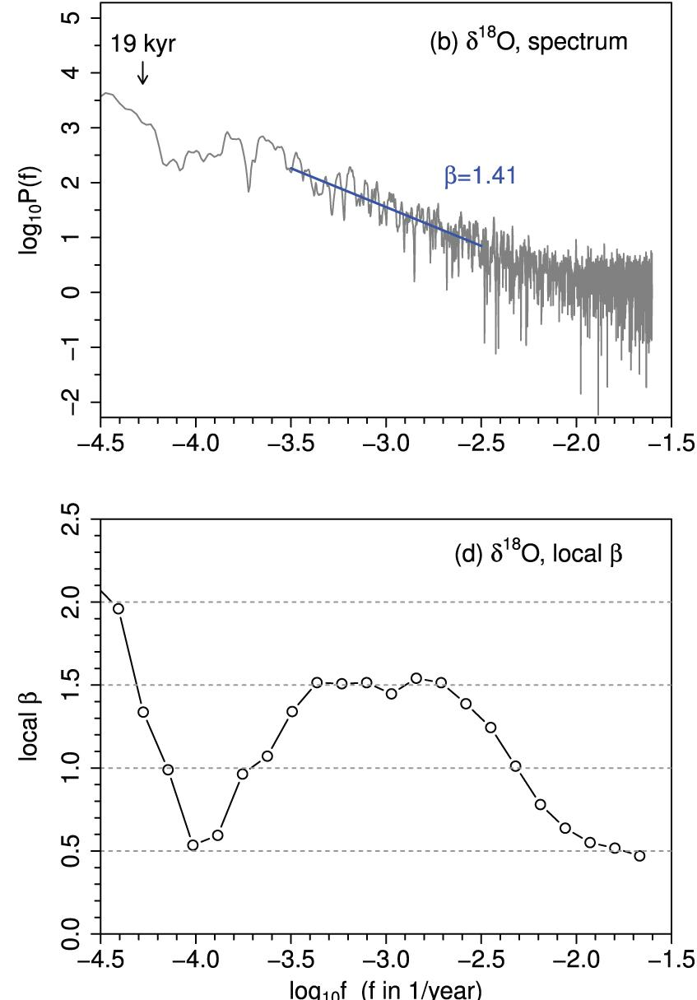

# Environments 

## Simulated

### Check color of noise: 

Quick exploration of function used to generate $\frac{1}{f}$-noise:

```{r slope,fig.cap="noise generator, changing $\\omega$"}
par(mfrow=c(3,2))
t=1000 #number of timestep
par(mfrow=c(3,2),mar=c(4,3,2,1))
for(alpha in 0:2){ #alpha as used in YK95 as our $\omega$
    ts=TK95(t,alpha) #generate random noise following Timmer & Koenig (1995) implemented in tuner package(https://rdrr.io/cran/tuner/src/r/waveforms.r)
    plot(ts,type="l",ylab=expression(theta),xlab="t",main=bquote(theta(delta==.(0),omega==.(alpha)))) #plot the environment
    y=getSpectrum(ts) #get spectrum of the environment generated
    x=1:length(y)
    plot(log10(x),log10(y),main="frequency spectrum",xlab="year (log10)")
    fit=lm(log10(y)~log10(x),cbind.data.frame(x=1:length(y),y=y)) #fit a linear model to check slope
    abline(fit,col="red") #visualise the fit and coefficient computed
    text(1,max(log(y)),paste("coef=",abs(round(fit$coefficients[2],2))),col="red")
}
```

### Check $\delta$ (variance) of noise

```{r deltacheck,fig.cap="Environment generator changing $\\delta$"}
t=1000 #number of timestep
par(mfrow=c(3,1),mar=c(5,4,3,1))
for(d in c(1,2,4)){ 
    ts=environment(t,omega=2,delta=d)
    plot(ts,ylim=c(-10,10),ylab=expression(theta),xlab="t",type="l",main=bquote(theta(delta==.(d),omega==2))) #plot the environment
}
```


### Check auto-correlation

By tuning $\omega$ we can change the level of auto-correlation 

```{r cov,fig.cap="autocorrelation"}
    par(mfrow=c(3,1))

    for(omega in 0:2){
        t=environment(50000,omega,.1)
        vtm=t[1:(length(t)-1)]
        vt=t[2:length(t)]
        cv=round(cov(vt,vtm),digit=3)
        plot((1:50000)[seq(1,50000,100)],t[seq(1,50000,100)],main=bquote(omega == .(omega)~","~delta==.1~", cov("*theta[t]*","*theta[t-1]*")" == .(cv)),ylab=bquote(theta[t]),,xlab="t",type="l",lwd=1)
    }

```

## Real Environments {#real-env}

### General Description

Dataset :

* NGRIP: greenland, $\delta^{18}0$ , [Andersen et al 2004](https://www.nature.com/articles/nature02805)
* NGRIP2: greenland, $\delta^{18}0$ , [Rasmussen et al 2014](https://www.sciencedirect.com/science/article/pii/S0277379114003485)
* VOSTOK: Antartic, $\delta D$ (deuterium in ice) , [Petit et al 1999](https://www.nature.com/articles/nature02805)
* LR04: wordlwid benthic drill, $\delta^{18}0$ (ratio 18/16 oxygen in sediment deposit) , [Lisiecki et al (2004)](https://agupubs.onlinelibrary.wiley.com/doi/full/10.1029/2004PA001071)
* LS18: worldwide, benthic drill, $\delta^{18}0$ (ratio 18/16 oxygen in sediment deposit) , [Lisiecki et al (2016)](https://agupubs.onlinelibrary.wiley.com/doi/pdf/10.1002/2016PA003002)
* EPICA:  Antartic, $\delta D$ (deuterium) , [Augustin et al (2004)](https://www.nature.com/articles/nature0259)
* Martrat:  , $U_{37}^K$ alkenone , [Martrat et al (2007)](https://science.sciencemag.org/content/317/5837/502?casa_token=oYjqKMPDD3UAAAAA:qtAeeIsbioo_fQ5l5myKdbMBMPd5lgVc9IaxNOJgthW7UYqROk3_SXYIssG18PSA0bVCdocD1-zoQpc)

```{r allenvironment,out.width="90%",fig.width=10,fig.height=8,fig.show="hold",fig.cap="preview of all datasets scaled with martrat total length (note that lr04 goes almost 10 times before martrat and is thus hidden here)",fig.link="_main_files/figure-html/allenvironment-1.png"}
### the following can be used to regenerate environment from their original datasets
    #ngripR=read.csv("data/ngripRAW.csv")
    #ngrip$year=-(ngripR$years.BP.2000)
    #ngrip$dOice=ngripR$permille #delta 18 O ice from greenland
    #ngrip=as.data.frame(ngrip)
    #ngrip=ngrip[order(ngrip$year),]
    #write.csv(file="data/ngrip.csv",ngrip,row.names=F)
    #ngrip=read.csv("data/ngrip.csv") 

    #ngrip2R=read.csv("data/ngrip2RAW.csv")
    #rm(ngrip2);ngrip2=c()
    #ngrip2$dOice=ngrip2R$d18O.NGRIP1
    #ngrip2$dOice[ngrip2R$Age>=9820]=ngrip2R$d18O.NGRIP2[ngrip2R$Age>=9820] #switch from ngrip1 to ngrip2
    #ngrip2$year=-(ngrip2R$Age)
    #ngrip2=as.data.frame(ngrip2)
    #ngrip2=ngrip2[seq(1,nrow(ngrip2),2),]
    #ngrip2=ngrip2[order(ngrip2$year),]
    #ngrip2=ngrip2[,c(2,1)]
    #ngrip2=ngrip2[!is.nan(ngrip2$dOice),]
    #write.csv(file="data/ngrip2.csv",ngrip2,row.names=F)
    #ngrip2=read.csv("data/ngrip2.csv") 

    #lr04R=read.csv("data/lr04RAW.csv")
    #lr04$year=-(lr04R$years.BP.2000*1000)
    #lr04$Ts=convertEpstein(lr04R$permille) #conert d18O to temperature using epstein 71
    #lr04$dOsea=lr04R$permille #delta 18 O ice from bentic drill  
    #lr04=as.data.frame(lr04)
    #lr04=lr04[order(lr04$year),]
    #write.csv(file="data/lr04.csv",lr04,row.names=F)
    #lr04=read.csv("data/lr04.csv")

    #ls16R=read.csv("data/ls16RAW.csv")
    #ls16$year=-(ls16R$years.BP.2000*1000)
    #ls16$Ts=convertEpstein(ls16R$permille) #conert d18O to temperature using epstein 71
    #ls16$dOsea=ls16R$permille #delta 18 O ice from bentic drill  
    #ls16=as.data.frame(ls16)
    #ls16=ls16[order(ls16$year),]
    #write.csv(file="data/ls16.csv",ls16,row.names=F)
    #ls16=read.csv("data/ls16.csv")


    # rescale all temperature differences  using vostok temperature
    #env="ngrip2"
    #i=get(env)
    #oldestDate=max(min(vostok$year,na.rm=T),min(i$year,na.rm=T))
    #ri=range(i[ i$year>oldestDate ,2])
    #rv=range(vostok$dTs[ vostok$year>oldestDate])
    #i$dTsVscales=(rv[2]-rv[1])/(ri[2]-ri[1])*(i[,2]-ri[2])+rv[2]
    #write.csv(file=paste0("data/",env,".csv"),i,row.names=F)


    #vostokR=read.csv("data/vostokRAW.csv")
    #vostok$year=-(vostokR$Ice.age..GT4.)
    #vostok$dD=vostokR$deut #delta D deuterium
    #vostok$dTs=vostokR$deltaTS #delta Temperature surface 
    #vostok=as.data.frame(vostok)
    #vostok=vostok[order(vostok$year),]
    #write.csv(file="data/vostok.csv",vostok,row.names=F)
    #vostok=read.csv("data/vostok.csv")

    #epicaR=read.csv("data/epica04RAW.csv")
    #epica$year=-(epicaR$Meanage.yrBP)
    #epica$dD=epicaR$deltaD.permill #delta D deuterium
    #epica=as.data.frame(epica)
    #epica=epica[order(epica$year),]
    #write.csv(file="data/epica.csv",epica,row.names=F)
    #epica=read.csv("data/epica.csv")
######

    #Everything above is then done by the 5 lines below
    namesRealEnv=c("epica","lr04","ls16","vostok","ngrip","martrat","ngrip2")
   dataEnv=list("epica"=expression(delta*D),"lr04"=expression(delta^18*O),"ls16"=expression(delta^18*O),"vostok"=expression(delta*D),"ngrip"=expression(delta*D),"martrat"=expression(S*S*T),"ngrip"=expression(delta*D))
    namesFun=c("getMean","getLast","getFirst")

    combiname=expand.grid(namesRealEnv,namesFun)

    allRealEnv=lapply(namesRealEnv,function(i)assign(i,read.csv(paste0("data/",i,".csv")),pos=.GlobalEnv)) #load all environment in a list AND as global value
    names(allRealEnv)=namesRealEnv
    allRealEnv=allRealEnv[order(sapply(allRealEnv,function(e)min(e$year)))]

    ##print the environment
    par(mar=c(0,4,0,2),oma=c(5,0,0,4))
    par(mfrow=c(length(namesRealEnv),1))
    s=2
    for(i in names(allRealEnv)){
        env=allRealEnv[[i]]
        oldest=min(epica$year)-100000
        plot(env$year,env[,2],type="l",lwd=1,ylab="",xlab="",main="",xlim=c(oldest,0),axes=F)
        mtext(i,4,2,cex=1.1) #environment label
        #if(side%%2==0)  s=2
        #else{ s=4}
        if(min(env$year)>oldest){
            axis(s,pos=min(env$year)-10000) #yaxis 
            text(x=min(env$year)-60000,y=mean(env[,2]),dataEnv[[i]],cex=1,srt=90) #yaxis title
        }
        else{
            axis(side=s,line=1)
            mtext(dataEnv[[i]],s,3,cex=.7) #yaxis title
        }
        #side=side+1
    }
    axis(1)
    mtext("year",1,3)
```

Each environment has different properties: their chronology span different time scale at different and varying resolution, with resulting on un-even frequencies. Moreover, each dataset uses different isotopes, extracted at different place, following  different protocols Each isotope  varies following its own scales and each scales need different approach to be translated in as temperatures.

The follwing table summarize some properties for all environment:
properties

```{r}
summaryEnv=sapply(allRealEnv,function(env){
       ri=range(getDateResolution(env$year))
       if(sd(ri)==0)
           resolution=paste(ri[1],"years")
       else
           resolution=paste("from:",ri[1],"years to:",ri[2],"years")
       t=2:(length(env[,2]))
       correl=cor(env[t,2],env[t-1,2])
       list(
            "$\\omega$"=round(getOmega(env[,2]),digit=2),
            "$\\delta$"=round(sd(env[,2]),digit=1),
            "cor(t,t-1)"=round(correl,digit=3),
            resolution=resolution,
            "#records"=length(env[,2]),
            "oldest record"=min(env$year)
            )
}
)
knitr::kable(as.data.frame(t(summaryEnv)),digits=c(1),align="lcccccc",caption=" environment properties")
```

The $\delta^{18}O$ measured by Lisiecki (2004, 2016), is a measure collected in benthic sediments, corresponding to the ratio between two isotopes of the oxygen found in formanifere shell. Changes observed in this ratio are expected to reflect changes in temperature in the water surrounding the foraminifera built their shel. [Epstein et al. (1953)](https://sci-hub.tw/https://pubs.geoscienceworld.org/gsa/gsabulletin/article-abstract/64/11/1315/4537) measured empirically the realtionship  between temperature and the ratio of the type of Oxygen animals capture in there skkeleton. $$ t = 16.5 - 4.5 \delta + 0.14\delta^2 $$
to translate measured $\delta^{18}O$ in temperature. 

The $\delta D$ measured by in NGRIP and EPICA dataset, is a measure of the ratio between two isotopes of the Hydrogen. It measures the ratio of hydrogen isotop deposited in the ice on the  floor but of the Antartic. [Petit et al. (1999)](https://sci-hub.tw/https://pubs.geoscienceworld.org/gsa/gsabulletin/article-abstract/64/11/1315/4537) propose an estimation of the Temperature given the $\delta D$ and a general and standard $\delta^{18}O$.

to translate measured $\delta^{18}O$ in temperature. 

```{r real-autocorelation,fig.show="hold",out.width="33%",fig.cap="Visual representation of the autocorleation of each environment."}
for(e in namesRealEnv){
    env=get(e)
    t=2:(length(env[,2]))
    correl=cor(env[t,2],env[t-1,2])
    plot(env[t,2],env[t-1,2],main=paste(e,"cor:",correl),ylab=expression(theta[t-1]),xlab=expression(theta[t1]))
}
```

### Scale of variation

As we can see the previous scales are not the same. to rescale all in siilar environment we match the variation of the changes during the time for VOSTOK dataset at the same scale as VOSTOK.


```{r rescale,out.width="80%",fig.show="hold",fig.width=8,fig.height=6,fig.cap="Rescale following Vostok Temperature, exept for Martrat dataset which has it's own temperature scale that we will use for following experiments"}

 # rescale all temperature differences  using vostok temperature
par(mfrow=c(length(namesRealEnv),1))
par(mar=c(3,4,0,2))
for(env in namesRealEnv){
    i=get(env)
    plot(i$year,i$dTsVscales,type="o",pch=20,main="",ylab=expression(delta*T[vscale]),xlab="")
    points(vostok$year,vostok$dTs,col="red",type="o",pch=20)
    mtext(env,4,0)
}
mtext("year",1,2)
```

The effect of this rescaling on the properties of the environment can be seen below. $X_v$ represents the metrics for the rescaled environment.

```{r table-real}
summaryEnv=sapply(allRealEnv,function(env)
                  {
                      t=2:(length(env[,"dTsVscales"]))
                      correl_v=cor(env[t,"dTsVscales"],env[t-1,"dTsVscales"])
                      t=2:(length(env[,2]))
                      correl=cor(env[t,2],env[t-1,2])
                      list(
                           "$\\omega$"=round(getOmega(env[,2]),digit=2),
                           "$\\omega_v$"=round(getOmega(env[,"dTsVscales"]),digit=2),
                           "$\\delta$"=round(sd(env[,2]),digit=1),
                           "$\\delta_v$"=round(sd(env[,"dTsVscales"]),digit=1),
                           "$cor(t,t-1)$"=round(correl,digit=3),
                           "$cor(t,t-1)_v$"=round(correl_v,digit=3)
                           )
                  }
)
knitr::kable(as.data.frame(t(summaryEnv)),digits=c(1))
```

As we can see this has no impact on the autocorrelation between time, it rescaled in a good way all environment in order to have $\delta$ between 2 and 3. On the other hand, impact of the slope of the noise isn't straightforward.


### Resolution of samples

Then, as resolution is changing, we need to re-sample the datasets or  interpolate missing point.

#### Under sampling  

To do so we can remove the high frequencies samples and keep only data points  correspond to one unique frequency, or use the mean (or any other function)  of the all points falling within a same time . We design two functions `getClosest` and `getMean2` that do a regular sampling of our dataset, taking only regularly spaced data points. both function start by using the lowest resolution to split the dataset into evenly distributed measure and then: use the closest point as the metrics for each time sampled (`getClosest`) or take all points between and use the mean of those points as the measure that correspond to the time in between the two frequencies. 

```{r resample,out.width="80%",fig.show="hold",fig.width=8,fig.height=6,fig.cap="Uniform Sampling, blac curve represent the original dataset, the green curve represent the result of the function getClosest and the red curve the results of the getMean2 function"}

par(mfrow=c(length(namesRealEnv),1))
for(e in namesRealEnv){
    env=allRealEnv[[e]]
    par(mar=c(3,4,0,2))
    plot(env$year,env$dTsVscales,type="o",pch=20,main="",ylab=expression(delta*T[vscale]),xlab="")
    fun=c("getMean2","getClosest")
    lapply(1:2,function(i)
           {
               assign("f",get(fun[i]))
               n=f(env$dTsVscales,env$year,max(getDateResolution(env$year)))
               points(n$year,n$data,col=i+1,pch=20,type="o")
           })
    mtext(e,4,0)
}

 # rescale all temperature differences  using vostok temperature
mtext("year",1,2)
```

```{r zoom,out.width="50%",fig.show="hold",fig.width=8,fig.height=6,fig.cap="Uniform Sampling as before but  zoom on the begining(left) and end (right) of the time series"}
par(mfrow=c(length(namesRealEnv),1))
for(e in namesRealEnv){
    env=allRealEnv[[e]]
    par(mar=c(3,4,0,2))
    plot(env$year,env$dTsVscales,type="o",pch=20,main="",ylab=expression(delta*T[vscale]),xlab="",xlim=c(min(env$year),min(env$year)-.05*min(env$year)))
    fun=c("getMean2","getClosest")
    ny=lapply(1:2,function(i)
           {
               assign("f",get(fun[i]))
               n=f(env$dTsVscales,env$year,max(getDateResolution(env$year)))
               points(n$year,n$data,col=i+1,pch=20,type="o")
               return(n$year)
           })
    abline(v=ny[[2]])
    mtext(e,4,0)
}


par(mfrow=c(length(namesRealEnv),1))
for(e in namesRealEnv){
    env=allRealEnv[[e]]
    par(mar=c(3,4,0,2))
    plot(env$year,env$dTsVscales,type="o",pch=20,main="",ylab=expression(delta*T[vscale]),xlab="",xlim=c(.05*min(env$year),0))
    fun=c("getMean2","getClosest")
    ny=lapply(1:2,function(i)
           {
               assign("f",get(fun[i]))
               n=f(env$dTsVscales,env$year,max(getDateResolution(env$year)))
               points(n$year,n$data,col=i+1,pch=20,type="o")
               return(n$year)
           })
    abline(v=ny[[2]])
    mtext(e,4,0)
}
 # rescale all temperature differences  using vostok temperature
mtext("year",1,2)
```
We report in the following table the properties of the environment once applied the resampling. $X_v$ represent the rescaled dataset, $X_gc$ the rescaled + resampled following `getClosest` and $X_gm$ rescaled + resampled following `getMeans2` function.

```{r}
summaryEnv=sapply(allRealEnv,function(env)
                  {
                      t=2:(length(env[,"dTsVscales"]))
                      correl_v=cor(env[t,"dTsVscales"],env[t-1,"dTsVscales"])
                      t=2:(length(env[,2]))
                      correl=cor(env[t,2],env[t-1,2])
                      n=lapply(1:2,function(i)
                                {
                                    assign("f",get(fun[i]))
                                    f(env$dTsVscales,env$year,max(getDateResolution(env$year)))
                                })
                      t=2:(length(n[[1]]$data))
                      correl_gc=cor(n[[2]]$data[t],n[[2]]$data[t-1])
                      correl_gm=cor(n[[1]]$data[t],n[[1]]$data[t-1])
                      list(
                           "$\\omega$"=round(getOmega(env[,2]),digit=2),
                           "$\\omega_v$"=round(getOmega(env[,"dTsVscales"]),digit=2),
                           "$\\omega_{gc}$"=round(getOmega(n[[2]]$data),digit=2),
                           "$\\omega_{gm}$"=round(getOmega(n[[1]]$data),digit=2),
                           "$\\delta$"=round(sd(env[,2]),digit=1),
                           "$\\delta_v$"=round(sd(env[,"dTsVscales"]),digit=1),
                           "$\\delta_{gc}$"=round(sd(n[[2]]$data),digit=1),
                           "$\\delta_{gm}$"=round(sd(n[[1]]$data),digit=1),
                           "$cor$"=round(correl,digit=3),
                           "$cor_v$"=round(correl_v,digit=3),
                           "$cor_{gc}$"=round(correl_gc,digit=3),
                           "$cor_{gm}$"=round(correl_gm,digit=3)
                           )
                  }
)
knitr::kable(as.data.frame(t(summaryEnv)),digits=c(1))
```


As we can see from this data table resample doesn't change much environment with frequencies that were already evenly distributed (NGRIP,LS06). For the other environments, the resampling as a smal effect on $\delta$ as it doesn change the y-distribution of the datapoints. On the other hand the `getMeans2` function tends to increase $\omega$ while decresing autocorrelation, while the getClosest function decrease both $\omega$ and  the level of autocorellation, which is expected as the mean will smooth the curves of the line while keeping only one dataset will increase the noise. 
Nonetheless, the main change is to be found in the number of record that greatly shrink as we can use only the lowest resolution.

```{r}
summaryEnv=sapply(allRealEnv,function(env){
       ri=range(getDateResolution(env$year))
       if(sd(ri)==0)
           resolution=paste(ri[1],"years")
       else
           resolution=paste("from:",ri[1],"years to:",ri[2],"years")
       n=lapply(1:2,function(i)
                {
                    assign("f",get(fun[i]))
                    f(env$dTsVscales,env$year,max(getDateResolution(env$year)))
                })
       t=2:(length(env[,2]))
       list(
            "res"=resolution,
            "res_{gc}"=paste(unique(getDateResolution(n[[2]]$year)),"year"),
            "res_{gm}"=paste(unique(getDateResolution(n[[1]]$year)),"year"),
            "#records"=length(env[,2]),
            "#rec_{gc}"=length(n[[2]]$year),
            "#rec_{gm}"=length(n[[1]]$year),
            "oldest record"=min(env$year)
            )
}
)
knitr::kable(as.data.frame(t(summaryEnv)),digits=c(1))
```

#### Interpolation of new data points {#interpol}
But undersampling means that we loose lot of real data.

How can we add realistic data points between inteveral? Using the slope of the noise of the current environment (stack LR04, 5 millions years, highest resolution: 1000 years) doesn't sound right as it implies to generate a noise using a slope calculated from frequencies lower than the frequencies of the noise generated. (_ie_ we use the slope of the noise calculated with climate changes happening at the level of thousand of years to estimates the frequencies of changes at the level of hundred of years). One solution could be to utilise a "likely" slope, estimated from data available at those same, high, frequency that the noise we want to generate.

To do so we estimate the slope of the noise for 500 years time series from the data of the NGRIP project (Andersen 2004, 50year high resolution, using slope calculated with 10 datapoints). This gives us a distribution of slopes for 500years slices and we use the one with the highest probability (represented as the red vertical line).


```{r, out.width = "45%",fig.cap="distributions of $\\omega$ for 500 years time series in data from Andersen 2004/NGRIP project",fig.show="hold"}

#realdata=read.csv("data/41586_2004_BFnature02805_MOESM1_ESM.csv")
#theta=realdata$dOsea
### calculate mean for smaller time windows
#the order and signe of the timeseries dosent matter: omega(a) == omega(-rev(a))

w=10
#omega_w=sapply(1:(length(theta)-w),function(i)getOmega(theta[i:(i+w)]) )
#saveRDS(file="data/omega_w.bin",omega_w)
omega_w=readRDS(file="data/omega_w.bin")
plot(omega_w,xlab="time units (500 years)",ylab=expression(omega))
plot(density(omega_w),ylab="proba",xlab=expression(omega))
#omw=hdr(omega_w)[["mode"]]
#saveRDS(file="data/omw.bin",omw)
omw=readRDS(file="data/omw.bin")
abline(v=omw,col="red")
```
<!--
As the scale between the two environments is not the same, the variations (_ie_ $\delta$)  can't be compared. For now I just use the distribution of the  standard deviation for 2105 slice of 5000 years from the LR04 stack (cf : http://www.dysoc.org/~simon/report/real-environment.html, figure Figure 19.3). Maybe once Liesiecki 2005 and Andersen 2004 are on similar scale we can use the $\delta$ from the second. And this is wha
-->
As the scale between the two environments are no scaled to match Vostok Temperature , the variations (_ie_ $\delta$)  can be compared. Thus I will use the mode of the distribution of $\delta$ for 500 years windows from NGRIP dataset.

```{r, out.width = "45%",fig.cap="distributions of $\\delta$ for 500 years time series in data from NGRIP dataset",fig.show="hold"}
ngrip=read.csv("data/ngrip.csv")
theta=ngrip$dTsVscales
delta_w=sapply(1:(length(theta)-w),function(i)sd(theta[i:(i+w)]))  
plot(delta_w,xlab="time units(25000 years)",ylab=expression(delta))
plot(density(delta_w),ylab="proba",xlab=expression(delta))
#dtw=hdr(delta_w)[["mode"]]
#saveRDS(file="data/dtw.bin",dtw)
dtw=readRDS(file="data/dtw.bin")
abline(v=dtw,col="red")
```

From this we can interpolate new points. To do so we take the linear interpolation done before and we ad it a noise generated given the value calculated before. We can check an exemple using the data point 100 and 101  from the lr04 stack, which represent the temperature scaled to Vostok temperature from $\delta^{18}O$ for the year `r lr04$year[100]` and the year `r lr04$year[101]`

```{r, fig.width=7,out.width = "45%",fig.cap="step for interpolating gaps",fig.show="hold"}
u=lr04[100:101,]
intLin=interpolate(u$dTsVscales,u$year,50)
reald=c(1,length(intLin))
#plot(u$year,u$dTsVscales,ylab=expression(delta^18*O),xlab="year",pch=20)
plot(u$year,u$dTsVscales,ylab="Scade Temperature",xlab="year",pch=20)
datin=as.numeric(names(intLin))
points(datin[-reald],intLin[-reald],col="green",pch=20,type="b")
legend("topright",c("real data","interpolate"),col=c(1,2),pch=20)

nois=environment(length(intLin)-1,omega=omw,delta=dtw)
plot(datin[-reald],nois[-1],ylab="unit of noise",xlab="year",pch=20,col=2,type="b")
plot(u$year,u$dTsVscales,ylab=expression(delta^18*O),xlab="year",pch=20,ylim=range(intLin[-1]+nois))
points(datin[-reald],intLin[-reald],col="green",pch=20,type="b")
points(datin,c(u$dTsVscales[1],intLin[-reald]+nois[-1],u$dTsVscales[2]),col="red",pch=20,type="b")
points(u$year,u$dTsVscales,pch=20)
```

Thus we can apply that to all gap in the dataset 

```{r interpolNgripFull, fig.width=14,out.width = "100%",fig.cap="interpolation linear + noise full dataset", fig.link="_main_files/figure-html/interpolNgripFull-1.png"}

    newt=interpolate(lr04$dTsVscales,lr04$year,finalres=250)
	#linear interpolation
    newy=seq(min(lr04$year),max(lr04$year),250)
	#linear + noise
    newtN=interpolate(lr04$dTsVscales,lr04$year,finalres=250,omega=omw,delta=dtw)
    plot(lr04$year,lr04$dTsVscales,type="l",lwd=5,xlab="years",ylab="scaled delta temp")
    lines(newy,newtN,type="l",col="red",lwd=2)
    lines(newy,newt,type="l",col="green")
```

The green line represents the linear interpolation while the red one the linea + noise.

Let see when we zoom on the first and last 30,000 years 

```{r, fig.width=4,fig.height=4,out.width = "40%",fig.cap="Zoom on the first (left) and last (right) 30,000 years interpolation linear + noise",fig.show="hold"}
    plot(lr04$year,lr04$dTsVscales,type="l",lwd=8,xlim=c(-5320000,-5290000),xlab="years")
    lines(newy,newtN,type="l",col="red",lwd=3)
    lines(newy,newt,type="l",col="green")
    plot(lr04$year,lr04$dTsVscales,type="l",lwd=5,xlim=c(-30000,0),xlab="years")
    lines(newy,newtN,type="l",col="red",lwd=3)
    lines(newy,newt,type="l",col="green")
```

Let see know how the parameter of our  interpolation impact the properties of our environments: 

```{r}


#explore=lapply(1:5,function(d)
#       {
#           lapply(1:5,function(o)
#           {
#               interpolate(ls16$dTsVscales,ls16$year,20,omega=o,delta=d)
#           })
#       })
#
```


```{r}
summaryEnv=sapply(allRealEnv[-3],function(env)
                  {
                      t=2:(length(env[,"dTsVscales"]))
                      correl_v=cor(env[t,"dTsVscales"],env[t-1,"dTsVscales"])
                      t=2:(length(env[,2]))
                      correl=cor(env[t,2],env[t-1,2])
                      ni=interpolate(env$dTsVscales,env$year,20,omega=1.788783,delta=0.09894122)
                      li=interpolate(env$dTsVscales,env$year,20)
                      t=2:(length(ni))
                      correl_ni=cor(ni[t],ni[t-1])
                      t=2:(length(li))
                      correl_li=cor(li[t],li[t-1])
                      list(
                           "$\\omega$"=round(getOmega(env[,2]),digit=2),
                           "$\\omega_v$"=round(getOmega(env[,"dTsVscales"]),digit=2),
                           "$\\omega_{li}$"=round(getOmega(li),digit=2),
                           "$\\omega_{ni}$"=round(getOmega(ni),digit=2),
                           "$\\delta$"=round(sd(env[,2]),digit=1),
                           "$\\delta_v$"=round(sd(env[,"dTsVscales"]),digit=1),
                           "$\\delta_{ni}$"=round(sd(ni),digit=1),
                           "$\\delta_{li}$"=round(sd(li),digit=1),
                           "$cor$"=round(correl,digit=3),
                           "$cor_v$"=round(correl_v,digit=3),
                           "$cor_{li}$"=round(correl_ni,digit=3),
                           "$cor_{ni}$"=round(correl_li,digit=3)
                           )
                  }
)
knitr::kable(as.data.frame(t(summaryEnv)),digits=c(1))
```

```{r}
summaryEnv=sapply(allRealEnv[-3],function(env){
       ri=range(getDateResolution(env$year))
       if(sd(ri)==0)
           resolution=paste(ri[1],"years")
       else
           resolution=paste("from:",ri[1],"years to:",ri[2],"years")
       ni=interpolate(env$dTsVscales,env$year,20,omega=1.788783,delta=0.09894122)
       li=interpolate(env$dTsVscales,env$year,20)
       list(
            "res"=resolution,
            "res_{li}"=paste(unique(getDateResolution(as.numeric(names(li))))[1],"year"),
            "res_{ni}"=paste(unique(getDateResolution(as.numeric(names(ni))))[1],"year"),
            "#records"=length(env[,2]),
            "#rec_{li}"=length(li),
            "#rec_{ni}"=length(ni),
            "oldest record"=min(env$year)
            )
}
)
knitr::kable(as.data.frame(t(summaryEnv)),digits=c(1))
```


### Spectral Analysis

In order to know at which time scale happen big changes we can do a spectral analysis of the time series. Spectral analysis of the Climate has been done since years.  
The technique use to do the estimation of the power density spectrum (PSD), since Yiou et al, 1996 "Spectral Analisis of Climate Data" until Mitsui et al 2019 "Is the glacial climate scale invariant?" seems to be the Multi Taper Methods (MTM). Here we use the same parameters than Mitsui et al 2019: 3 taper and bandwith of 2.

Mitsui et al limited their analysis to the glacial period: ie from $-12,000$ to $-106,000$.  Here I reproduce their spectrogram:


```{r mtisui-fig2,out.width="35%",fig.show="hold",fig.height=10,fig.cap="redo Mitsui et al 2019 analysis"}
mitsui=ngrip2[ ngrip2$year < -12000 & ngrip2$year> -106000,]
par(mfrow=c(2,1))

m.spec=getSpectrumMTM(mitsui$dOice,mitsui$year)
plot(log10(m.spec$freq),log10(m.spec$spec),xlim=c(-4.5,-1.5),xaxs="i",type="l",xlab=expression(log[10]*f),ylab="P(f)")
x=log10(m.spec$freq)
y=log10(m.spec$spec)

w=x > -3.5 & x < -2.5 #window to comput beta (omega for us)
fitw=lm(y[w] ~ x[w])
abline(fitw,col="dark blue")
text(-2.5,3,bquote(omega == .(round(fitw$coefficients[[2]],digit=2))),col="dark blue")


middle=seq(-4.5,max(x),.1)
allOmegas=sapply(middle,getOmega2,x=x,y=y)
plot(middle,allOmegas,type="b",xaxs="i",xlab=expression(log[10]*f),ylab=expression(omega),ylim=c(0,2.5))

```


```{r mtisui-fig2-orig,out.width="60%",fig.show="hold",fig.height=10,fig.cap="Fig2 Mitsui et al 2019 analysis"}

```

What does it changes if we do the anlyse of the full spectrum? 

```{r fullspec-fig2,out.width="65%",fig.show="hold",fig.height=10}
par(mfrow=c(2,1),mar=c(5,1,1,1),oma=c(0,5,0,0))

m.spec=getSpectrumMTM(ngrip2$dOice,ngrip2$year)
plot(log10(m.spec$freq),log10(m.spec$spec),xaxs="i",type="l",xlab="",ylab="P(f)")

w=x > -3.5 & x < -2.5 #window to comput beta (omega for us)
fitw=lm(y[w] ~ x[w])
abline(fitw,col="dark blue")
text(-2.5,3,bquote(omega == .(round(fitw$coefficients[[2]],digit=2))),col="dark blue")

middle=seq(-5,max(x),.1)
allOmegas=sapply(middle,getOmega2,x=x,y=y)
plot(middle,allOmegas,type="b",xaxs="i",xlab=expression(log[10]*f),ylab=expression(omega),ylim=c(0,2.5))

```


```{r allScales,fig.out="50%",fig.cap="Power Spectral Density (usin MTM) for all rescaled envrionments"}

m.spec=getSpectrumMTM(ngrip2$dOice,ngrip2$year)
plot(log10(m.spec$freq),log10(m.spec$spec),xlim=c(-5.5,-1.5),ylim=c(-2,6),axes=F,type="n",xlab="Cycle Length (years)",ylab=expression(log[10]*P(f)))

allSpec=lapply(allRealEnv,function(env){
rs=getClosest(env$dTsVscales,env$year,max(getDateResolution(env$year)))
m.spec=getSpectrumMTM(env$dTsVscales,env$year)
cbind(x=log10(m.spec$freq),y=log10(m.spec$spec))
})

allcol=rainbow(length(allSpec),alpha=.8)
na=lapply(1:length(allSpec),function(u)lines(allSpec[[u]],col=allcol[u])) 

legend("topright",legend=names(allSpec),col=allcol,lwd=2)
axis(1,at=seq(-6,-2,by=1),label=round(1/10^seq(-6,-2,by=1)))
axis(2)

```

