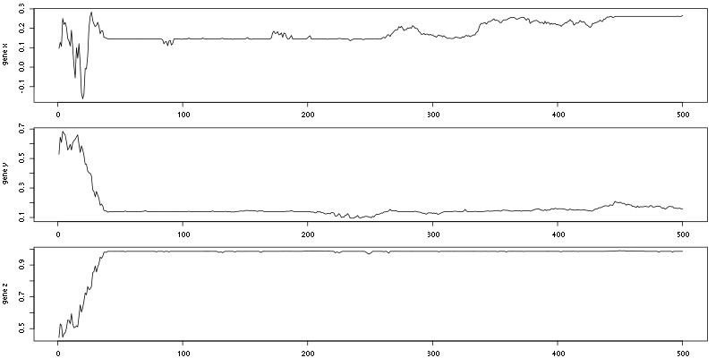

#Evolution and social Learning

To get this folder: 

```bash
git clone git@framagit.org:sc/pleistoclimate.git
```

then to test the model:

```bash
cd pleistoclimate/
```

then run `R` within this folder

and  from `R`

```R
source("protomodels.R")
```

to load the model and the functions it uses and a simple test can be done:

```R
#setup the parameters
epsilon=c(x=1,y=1,z=1) #the standard deviation of the error associated with the expression of each phenotype (p' to p''')
sigma=c(s=2,y=2,z=2) #Selection strength
m=c(x=.3,y=.3,z=.3)
type="best" #type of copy for social learning
n=100
tstep=500

#run the simulation
test=simpleEvoModel(n = 100,tstep = 500,omega = 2,delta = 4 ,b = 2,K = 200,mu=0.001,epsilon = epsilon,sigma = sigma)

```

For know in the resulting list (here test), I keep all the populations for all time steps, to check if everything is good and how the different variable of interest (x,y,z,...) are distributed. Some summaries statistics are also available in `test$meanf`, `test$popsize`,... 

To plot the available summaries:

```R
par(mfrow=c(3,1))
par(mar=c(2,4,1,1))
plot(test$meanf,type="l",ylab="meanf")
plot(test$env,type="l",col="red",ylab="environment")
plot(test$popsize,type="l",col="blue",ylab="popsize")
```


To get the mean and standard deviation of z for each time step:

```R
meansdz=sapply(test$allpop,function(i)c(sd(i[["z"]]),mean(i[["z"]])))
```
To check the evolution of the mean of each genes 

```R
genes=c("x","y","z")
par(mfrow=c(3,1))
par(mar=c(2,4,1,1))
sapply(genes,function(g)plot(sapply(test$allpop,function(i)mean(i[[g]])),ylab=paste("gene",g),type="l"))
```


3d plot of the mean fitness given time and environment

```R
library(rgl)
plot3d(test$meanf,test$env,col=cols,pch=20)
```

In the next block we explore the impact of omega on the mean value of z at the end of the simulation. To do that we creat a list of omegas and for each of them we run 100 simulations: 
```R
omegas=seq(0,3,.5)
allos_best=sapply(omegas,function(o)replicate(100,mean(simpleEvoModel(100,300,omega = o,delta = 2 ,b=2,K=200,mu=0.001,epsilon=epsilon,sigma=sigma,log=T)$pop$z)))
boxplot(allos_best,ylab="mean value of z",xlab=expression(omega),axes=F) 
axis(2)
axis(1,1:length(omegas),label = omegas)
box()
```


By default `simpleEvoModel` use the best mechanism to copy, we can compare this when using random by simply doing:

```R
allos_rand=sapply(omegas,function(o)replicate(100,mean(simpleEvoModel(100,300,omega = o,delta = 2 ,b=2,K=200,mu=0.001,epsilon=epsilon,sigma=sigma,type="random",log=T)$pop$z)))
boxplot(allos_rand,ylab="mean value of z",xlab=expression(omega),axes=F) 
axis(2)
axis(1,1:length(omegas),label = omegas)
box()
```

