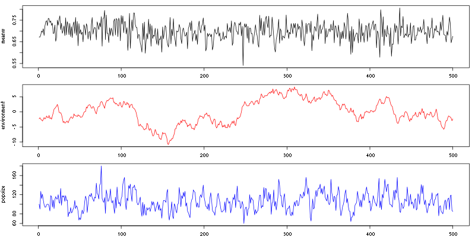
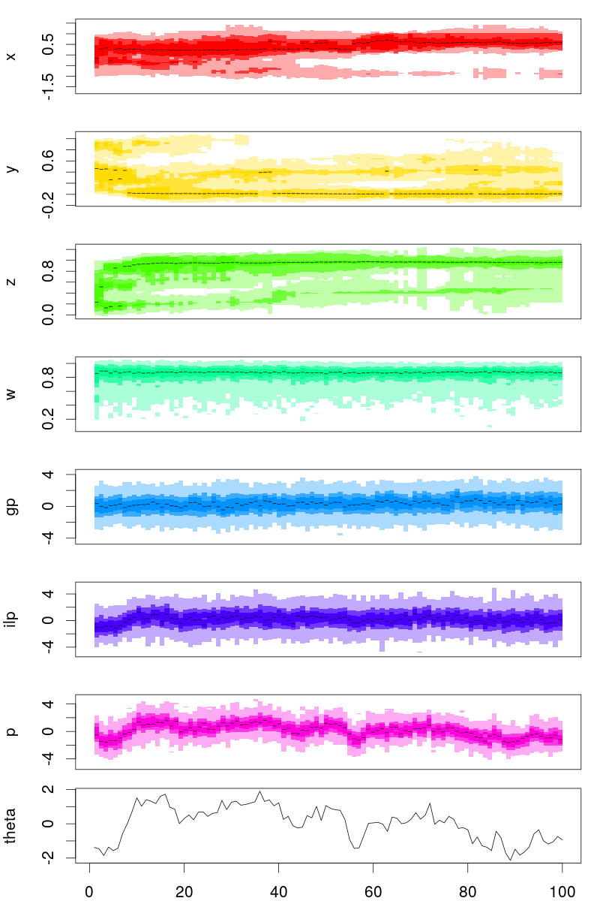

# Evolution, social Learning and climate fluctuation

## Install as a package

```{r}
library(devtools)
devtools::install_github("simoncarrignon/evosolearn")
```

## ModiInstallfy as a package

--- 

Below's indication should'nt be used anymore


## Clone and run the model:

To clone this folder: 

```bash
git clone git@framagit.org:sc/pleistoclimate.git
```

Most of in bookdown:
```r
library(bookdown)
render_book("index.Rmd",output_dir="~/public_html/report/")
```

then to test the model:

```bash
cd pleistoclimate/
```

then run `R` within this folder
and  from `R`

```R
source("protomodels.R")
```
to load the model and the functions it uses. To do a simple run of the model one can do:

```R
#setup the parameters
epsilon=c(x=1,y=1,z=1) #the standard deviation of the error associated with the expression of each phenotype (p' to p''')
sigma=c(s=2,y=2,z=2) #Selection strength
m=c(x=.3,y=.3,z=.3)
type="best" #type of copy for social learning
n=100
tstep=500

#run the simulation
test=simpleEvoModel(n,tstep,omega = 1.5,delta = 1 ,b=2,K=500,mu=c(x=0.01,y=0.01,z=0.01),epsilon=c(x=1,y=1,z=1),sigma=c(s=2,y=2,z=2),log=T,type="best")
```

For know in the resulting list (here `test`), I return all the populations for all time steps. This is for now, to check if everything is good and how the different variables of interest (x,y,z,...) are distributed. Some summaries statistics are also available in `test$meanw`, `test$popsize`,... 

To plot the available summaries:

```R
par(mfrow=c(3,1))
par(mar=c(2,4,1,1))
plot(test$meanw,type="l",ylab="meanw")
plot(test$env,type="l",col="red",ylab="environment")
plot(test$popsize,type="l",col="blue",ylab="popsize")
```



To get the mean and standard deviation of z for each time step:

```R
meansdz=sapply(test$allpop,function(i)c(sd(i[["z"]]),mean(i[["z"]])))
```


To plot mean and sd for all variables + theta from the output of `simpleEvoModel`
```R
test=simpleEvoModel(n = 1000,tstep = 500,omega = 2,delta = 4 ,b = 2,K = 200,mu=0.001,epsilon = c(x=1,y=1,z=1),sigma = c(s=2,y=2,z=2),m=c(x=.3,y=.3,z=.3),type = "best")
plotAllVariable(test)
```

I also like to plot the full distribution using High Density region in order to see multi modal distributionsi (on the right):

```R
plotAllVariable(test,hdr=T)
```





Now we compare theta (environment), p (mature phenotype) and w (fitness):


The code to do this :

```R
par(mfrow=c(2,1),cex=1.2)
par(mar=c(2,4,2,4))
plot(sapply(1:tstep,function(it)mean(t$allpop[[it]]$p)),type="l",ylim=range(sapply(t$allpop,"[[","p")),ylab="p",main="Phenotype and theta",bty="n",)
lines(sapply(1:tstep,function(it)mean(t$allpop[[it]]$p)+sd(t$allpop[[it]]$p)),lty=3)
lines(sapply(1:tstep,function(it)mean(t$allpop[[it]]$p)-sd(t$allpop[[it]]$p)),lty=3)
par(new=T)
plot(t$env,type="l",col="blue",yaxt="n",xaxt="n",ylim=range(sapply(t$allpop,"[[","p")),ylab="",bty="n",)
axis(4,col="blue",col.axis="blue")
mtext(expression(theta),4,2,col="blue")

plot( sapply(1:tstep,function(it)mean(abs(t$allpop[[it]]$p-t$env[it]))),ylim=range(sapply(1:tstep,function(it)range(abs(t$allpop[[it]]$p-t$env[it])))),ylab=expression(group("|",theta - p,"|")),bty="n",type="l",main="Distance to theta and fitness")
lines(sapply(2:tstep,function(it)mean(abs(t$allpop[[it]]$p-t$env[it]))+sd(abs(t$allpop[[it]]$p-t$env[it]))),lty=3)
lines(sapply(1:tstep,function(it)mean(abs(t$allpop[[it]]$p-t$env[it]))-sd(abs(t$allpop[[it]]$p-t$env[it]))),lty=3)
par(new=T)
plot( sapply(1:tstep,function(it)mean(t$allpop[[it]]$w)),ylim=range(sapply(t$allpop,"[[","w")),type="l",col="red",yaxt="n",xaxt="n",bty="n",ylab="")
lines(sapply(1:tstep,function(it)mean(t$allpop[[it]]$w)+sd(t$allpop[[it]]$w)),col="red",lty=3)
lines(sapply(1:tstep,function(it)mean(t$allpop[[it]]$w)-sd(t$allpop[[it]]$w)),col="red",lty=3)
axis(4,col="red",col.axis="red")
mtext("w",4,2,col="red")
```


## Check environment 

Some quick exploration of the environment generation function

```R
par(mfrow=c(3,2))
t=10000 #number of timestep
par(mfrow=c(3,2),mar=c(2,2,1,1))
for(alpha in 0:2){ #alpha as used in YK95 is our $\omega$
    ts=TK95(t,alpha) #generate random noise following Timmer & Koenig (1995) implemented in tuneR package(https://rdrr.io/cran/tuneR/src/R/Waveforms.R)
    plot(ts,type="l") #plot the environment
    y=getSpectrum(ts) #get spectrum of the environment generated
    x=1:length(y)
    plot(log(x),log(y))
    fit=lm(log(y)~log(x),cbind.data.frame(x=1:length(y),y=y)) #fit a linear model to check slope
    abline(fit,col="red") #visualise the fit and coefficient computed
    text(1,max(log(y)),paste("coef=",abs(round(fit$coefficients[2],2))),col="red")
}
```


## Further exploration of the model

3d plot of the mean fitness given time and environment

```R
library(rgl)
plot3d(test$meanw,test$env,col=cols,pch=20)
```

In the next block we explore the impact of omega on the mean value of z at the end of the simulation. To do that we creat a list of omegas and for each of them we run 100 simulations: 
```R
omegas=seq(0,3,.5)
allos_best=sapply(omegas,function(o)replicate(100,mean(simpleEvoModel(100,300,omega = o,delta = 2 ,b=2,K=200,mu=0.001,epsilon=epsilon,sigma=sigma,log=T)$pop$z)))
boxplot(allos_best,ylab="mean value of z",xlab=expression(omega),axes=F) 
axis(2)
axis(1,1:length(omegas),label = omegas)
box()
```


By default `simpleEvoModel` use the best mechanism to copy, we can compare this when using random by simply doing:

```R
allos_rand=sapply(omegas,function(o)replicate(100,mean(simpleEvoModel(100,300,omega = o,delta = 2 ,b=2,K=200,mu=0.001,epsilon=epsilon,sigma=sigma,type="random",log=T)$pop$z)))
boxplot(allos_rand,ylab="mean value of z",xlab=expression(omega),axes=F) 
axis(2)
axis(1,1:length(omegas),label = omegas)
box()
```


Similarly we can explore the impact of omega and delta at the same time:
```R
osnds=parSapply(cl,omegas,function(o)sapply(deltas,function(d){print(paste(o,d));mean(replicate(50,mean(simpleEvoModel(100,50,omega = o,delta = d ,b=2,K=200,mu=0.001,epsilon=epsilon,sigma=sigma,log=F)$pop$z)))}))
osnds_rand=parSapply(cl,omegas,function(o)sapply(deltas,function(d){print(paste(o,d));mean(replicate(50,mean(simpleEvoModel(100,50,type="random",omega = o,delta = d ,b=2,K=200,mu=0.001,epsilon=epsilon,sigma=sigma,log=F)$pop$z)))}))
```

### Select best individual


### Select random individual


####

png("allvariables.png",pointsize = 14,width=800,height=1200)
plotAllVariable(t)
dev.off()

png("allvariables_HDR.png",pointsize = 14,width=800,height=1200)
par(cex=2)
plotAllVariable(t,hdr=T)
dev.off()

