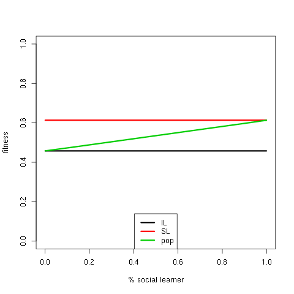
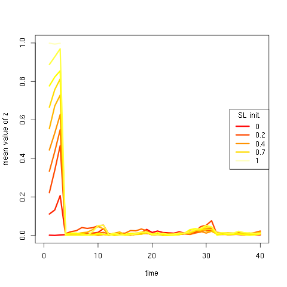
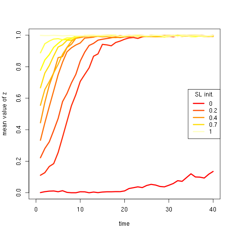

# Check Social Learning Strategies

## Compare with Bentley Neutral Model

To compare the model with the neutral model usually studied in cultural evolution, a few adjustement has to be made:
In the traditional model agents are both social and "individual" learner. When they "learn" individually, they inovate at a rate $\mu$ other was they randomly copy another agent. In the current model, if social learner learn only through social learning (ie $z=1$), they can't innovate $p=p''+z(P-p'')\Rightarrow p=P$ where P is the phenotype copied.  To emulate the inovation rate of the neutral model we setup a population made of a percentage of $\mu$ individual learners that generate new phenotypes at each generation (with $\mu_x=1$) while the rest of the population ($1-\mu$) are social learn ($x,y=0,z=1$). All other mutation rates are set to 0, thus we have a rate of apparition of new phenotype of $\mu$.

To stay closer to original neutral model we introduce a simple reproduction scenario independant to fitness where every individual create one offspring (thus we have a static population size). Environment  doesn't matter thus environment will stay constant thoughout the simulations.

```{r,eval=F,echo=F}
for(n in c(1000,10000)){
for(mu in c(0.01,0.001)){
m=100
pop=generatePop(n,distrib=list(x=c(runif(n,-1,1)),y=rep(0,n),z=c(rep(1,n*(1-mu)),rep(0,n*mu))),df=F)
pop[,"p"]=pop[,"x"]

png(paste0("images/ccfdPhenotype_MU",mu,"_N",n,".png")) 
plot(1,1,log="xy",xlab="phenotype frequencies",ylab="ccfd (%)",xlim=c(1,10000),ylim=c(0.01,100),type="n",main=bquote(mu == .(mu) ~ N == .(n)))
for(i in 1:10){
    soci=evosolearn(pop = pop, tstep = 50,log=T,theta=rep(0,1000),sigma=c(s=10000,y=10000,z=10000),omega=0,delta=0,b=2,K=1000,m=c(x=.1,y=0,z=0),mu=c(x=mu,y=0,z=0),allpops=T,repro="unique",selection=F,statvar=c("p","x","z"),statfun="mean",E=c(x=0,y=0,z=0),sls="random") 
    u=unlist(sapply(soci$allpop,function(s)s[,"p"]))
    freqt=table(u)
    cc=ccfd(freqt)
    lines(cc[,"x"],cc[,"y" ],col="green",lwd=2)
    random=randomCascades(Nmax=n,Nmin=n,mu=mu,t_steps = 50)
    cc=ccfd(random$size)
    lines(cc[,"x"],cc[,"y" ],col="red",lwd=2)
}
legend("bottomleft",lwd=2,col=c("red","green"),legend=c("model from carrignon et al 2019","model pleisto evol"))
dev.off()
}
}
```

```{r}
allimages=lapply(c(1000,10000),function(n)lapply(c(0.01,0.001),function(mu)paste0("images/ccfdPhenotype_MU",mu,"_N",n,".png")))
allimages=unlist(lapply(allimages,unlist))
```

```{r reproNeutralDistrib,out.width="50%",fig.show="hold",fig.link=allimages,fig.cap="distribution of phenotype (Complementary Cumulative Density Funcion) of a simpler version of our model without growth vs neutral model"}
knitr::include_graphics(allimages)
```


When population growth is introduced the general shape changes slightly

```{r,eval=F,echo=F}
for(n in c(1000,10000)){
for(mu in c(0.01,0.001)){
m=100
pop=generatePop(n,distrib=list(x=c(runif(n,-1,1)),y=rep(0,n),z=c(rep(1,n*(1-mu)),rep(0,n*mu))),df=F)
pop[,"p"]=pop[,"x"]

png(paste0("images/ccfdPhenotypeGrowth_MU",mu,"_N",n,".png")) 
plot(1,1,log="xy",xlab="phenotype frequencies",ylab="ccfd (%)",xlim=c(1,10000),ylim=c(0.01,100),type="n",main=bquote(mu == .(mu) ~ N == .(n)))
for(i in 1:10){
    soci=evosolearn(pop = pop, tstep = 50,log=T,theta=rep(0,1000),sigma=c(s=10000,y=10000,z=10000),omega=0,delta=0,b=2,K=n,m=c(x=.1,y=0,z=0),mu=c(x=mu,y=0,z=0),allpops=T,repro="asex",selection=T,statvar=c("p","x","z"),statfun="mean",E=c(x=0,y=0,z=0),sls="random") 
    u=unlist(sapply(soci$allpop,function(s)s[,"p"]))
    freqt=table(u)
    cc=ccfd(freqt)
    lines(cc[,"x"],cc[,"y" ],col="green",lwd=2)
    random=randomCascades(Nmax=n,Nmin=n,mu=mu,t_steps = 50)
    cc=ccfd(random$size)
    lines(cc[,"x"],cc[,"y" ],col="red",lwd=2)
}
legend("bottomleft",lwd=2,col=c("red","green"),legend=c("model from carrignon et al 2019","model pleisto evol+growth"))
dev.off()
}
}
```

```{r}
allimages=lapply(c(1000,10000),function(n)lapply(c(0.01,0.001),function(mu)paste0("images/ccfdPhenotypeGrowth_MU",mu,"_N",n,".png")))
allimages=unlist(lapply(allimages,unlist))
```

```{r reproNeutralDistribGrowth,out.width="50%",fig.show="hold",fig.link=allimages,fig.cap="distribution of phenotype (Complementary Cumulative Density Funcion) of our model with growth vs neutral model"}
knitr::include_graphics(allimages)
```


```{r,eval=F,echo=F}
for(n in c(1000,10000)){
for(mu in c(0.01,0.001)){
m=100
pop=generatePop(n,distrib=list(x=c(runif(n,-1,1)),y=rep(0,n),z=c(rep(1,n*(1-mu)),rep(0,n*mu))),df=F)
pop[,"p"]=pop[,"x"]

png(paste0("images/ccfdPhenotypeBEST_MU",mu,"_N",n,".png")) 
plot(1,1,log="xy",xlab="phenotype frequencies",ylab="ccfd (%)",xlim=c(1,100000),ylim=c(0.1,100),type="n",main=bquote(mu == .(mu) ~ N == .(n)))
for(i in 1:10){
    soci=evosolearn(pop = pop, tstep = 50,log=T,theta=rep(0,1000),sigma=c(s=10000,y=10000,z=10000),omega=0,delta=0,b=2,K=1000,m=c(x=.1,y=0,z=0),mu=c(x=mu,y=0,z=0),allpops=T,repro="asex",selection=T,statvar=c("p","x","z"),statfun="mean",E=c(x=0,y=0,z=0),sls="best") 
    u=unlist(sapply(soci$allpop,function(s)s[,"p"]))
    freqt=table(u)
    cc=ccfd(freqt)
    lines(cc[,"x"],cc[,"y" ],col="green",lwd=2)
    random=randomCascades(Nmax=n,Nmin=n,mu=mu,t_steps = 50)
    cc=ccfd(random$size)
    lines(cc[,"x"],cc[,"y" ],col="red",lwd=2)
}
legend("bottomleft",lwd=2,col=c("red","green"),legend=c("model from carrignon et al 2019","model pleisto evol+bestSLS"))
dev.off()
}
}
```

When individual can socially copy the best phenotype without error,  as one could expect, this best phenotype is quickly selected after few generations and get reproduced all the time. Thus a few phenotypes are repeated once or twice (the one at the initilisation and those that randomly appears through mutation) while another one (the best) is repeated all the time throughtout the simulations.

```{r}
allimages=lapply(c(1000,10000),function(n)lapply(c(0.01,0.001),function(mu)paste0("images/ccfdPhenotypeBEST_MU",mu,"_N",n,".png")))
allimages=unlist(lapply(allimages,unlist))
```

```{r reproNeutralDistribhBEST,out.width="50%",fig.show="hold",fig.link=allimages,fig.cap="distribution of phenotype (Complementary Cumulative Density Funcion) of our model with BEST SLS vs neutral model"}
knitr::include_graphics(allimages)
```


## Reproduce Rogers paradox

We detected  the Rogers paradox in our simulation when counting the proportion of different strategies n our population, we show that, by looking at large set of simulation with different mutation rate, $k_z$ and $k_y$,  when population tends to be made of only social learner the fitness of this population drop drastically ([here](http://www.dysoc.org/~simon/report/exploring-impact-of-cost-and-selective-pressure-sexual-reproduction.html) and [here](http://www.dysoc.org/~simon/report/exploring-impact-of-cost-and-selective-pressure-asexual-reproduction.html)).

Here we reproduce this effect using a different setup closer to the original Rogers publication with no genetic adaptation. To do so we need a environment that changes at a rate $u=.8$ in a discrete way. Then we need parameters set in a way that if behavior doesnt match the environment the fitness of individual is 0 where whn it matches the fitness of individual learner is less than the fitness of social learned. To achieve that we choose:

* $\sigma_s =0.2$
* $\sigma_y =0.8$
* $\sigma_z =4$
* Genotype of Individual Leaners $i$:  $y_i=1,z_i=0$
* Genotype of Social Leaners $s$:  $y_s=0,z_s=1$

Thus :

* fitness of individual learner $i$ when match is: $w_i\approx$ `r round(fitness(1,1,0,1,0,.2,.8,4),digits=2)`
* fitness of social learner $s$ when match is: $w_s\approx$ `r round(fitness(1,1,0,0,1,.2,.8,4),digits=2)`
* fitness of $i$ when mismmatch is: $w_i\approx$ `r round(fitness(0,1,0,1,0,.2,.8,4),digits=2)`
* fitness of $s$ when mismatch is: $w_s\approx$ `r round(fitness(0,1,0,0,1,.2,.8,4),digits=2)`

First we run the simulation without evolution (no mutation, no reproduction) to check the expected fitness of the different type of individual  in our model given the parameters chosen and see if this reproduce Rogers Fig 1. 

```{r,eval=F,echo=F}
tsteps=1000
env=rep(1,tsteps)
for(i in 2:length(env)){
    if(runif(1)<.8){
        if(runif(1)<.5)
            env[i]=env[i-1]+1
        else
            env[i]=env[i-1]
    }
    else env[i]=env[i-1]
}

freqSL=seq(.001,.999,length.out=10)
allfitness=lapply(freqSL,function(percentage){
                  n=1000
                  pop=generatePop(n,distrib=list(x=rep(0,n),y=rep(0,n),z=rep(0,n)))
                  pop[,"p"]=!env[1]
                  sl=1:(n*percentage)
                  il=(n*percentage+1):n
                  pop[sl,"z"]=1
                  pop[il,"y"]=1

                  soci=evosolearn(pop = pop, tstep = tsteps,log=T,theta=env,sigma=c(s=.2,y=.8,z=4),omega=0,delta=0,b=2,K=1000,m=c(x=0,y=0,z=0),mu=c(x=0,y=0,z=0),allpops=T,repro="unique",selection=F,statvar=c("p","x","z","w"),statfun="mean",E=c(x=0,y=0,z=0),sls="random")
                  soci

})
meanAll=sapply(allfitness,function(soci){
                  cbind(y=mean(sapply(soci$allpop,function(i){mean(i[i[,"y"]==1,"w"])}),na.rm=T),
                        z=mean(sapply(soci$allpop,function(i){mean(i[i[,"z"]==1,"w"])}),na.rm=T),
                        pop=mean(sapply(soci$allpop,function(i){mean(i[,"w"])}),na.rm=T))
})

png("images/illuRoger.png")
plot(1,1,type="n",ylim=c(0,1),xlim=c(0,1),xlab="% social learner",ylab="fitness")
for(i in 1:3){
   lines(freqSL,meanAll[i,],col=i,lwd=3)
}
legend("bottom",legend=c("IL","SL","pop"),col=1:3,lwd=3)
dev.off()
```
```{r ,rogers1988,out.width="50%",fig.align="center",fig.cap="Comparing Rogers (1988), Fig 1. (left) with our model (right)",fig.show="hold"}
knitr::include_graphics(c("images/rogerFig1.png","images/illuRoger.png"))
```
 
If social learner can copy the best phenotype this disappear as unless ther eis no individual learner at all, all social learner can find and copy the good phenotype. 
```{r,eval=F,echo=F}

allfitness=lapply(freqSL,function(percentage){
                  n=1000
                  pop=generatePop(n,distrib=list(x=rep(0,n),y=rep(0,n),z=rep(0,n)))
                  pop[,"p"]=env[1]
                  sl=1:(n*percentage)
                  il=(n*percentage+1):n
                  pop[sl,"z"]=1
                  pop[il,"y"]=1

                  soci=evosolearn(pop = pop, tstep = tsteps,log=T,theta=env,sigma=c(s=.2,y=.8,z=4),omega=0,delta=0,b=2,K=1000,m=c(x=0,y=0,z=0),mu=c(x=0,y=0,z=0),allpops=T,repro="unique",selection=F,statvar=c("p","x","z","w"),statfun="mean",E=c(x=0,y=0,z=0),sls="best")
                  soci

})
meanAll=sapply(allfitness,function(soci){
                  cbind(y=mean(sapply(soci$allpop,function(i){mean(i[i[,"y"]==1,"w"])}),na.rm=T),
                        z=mean(sapply(soci$allpop,function(i){mean(i[i[,"z"]==1,"w"])}),na.rm=T),
                        pop=mean(sapply(soci$allpop,function(i){mean(i[,"w"])}),na.rm=T))
})

png("images/illuRogerBest.png")
plot(1,1,type="n",ylim=c(0,1),xlim=c(0,1),xlab="% social learner",ylab="fitness")
for(i in 1:3){
   lines(freqSL,meanAll[i,],col=i,lwd=3)
}
legend("bottom",legend=c("IL","SL","pop"),col=1:3,lwd=3)
dev.off()
```
```{r rogerBest,out.width="50%",fig.align="center",fig.cap="When social learning is able to spot the best individual the Rogers effect disappear"}

```

 
At an evolutionary level, the expected outcome of Rogers paradox is that Social learning should not evolve when environment is changing, as in the long term the mean fitness of a population made of social learners will decrease. Though our mutation process isn't exactly the same than Rogers (in his experiments phenotypes flip from social learners to individual learner randomly), this is what we observe with mutation and asexual reproduction (cf below). When the rate of change is high enough ($u=.8$ in Rogers model), social learning is not selected no matter the proportion of social learners in the initial population, with the risks that the whole population get extinct if social learning is fixed. 

```{r,eval=F,echo=F}
tsteps=40
env=rep(1,tsteps)
for(i in 2:length(env)){
    if(runif(1)<.8){
        if(runif(1)<.5)
            env[i]=!env[i-1]
        else
            env[i]=env[i-1]
    }
    else env[i]=env[i-1]
}

freqSL=seq(.001,.999,length.out=10)
allfitness=lapply(freqSL,function(percentage){
                  n=1000
                  pop=generatePop(n,distrib=list(x=rep(0,n),y=rep(0,n),z=rep(0,n)))
                  pop[,"p"]=env[1]
                  sl=1:(n*percentage)
                  il=(n*percentage+1):n
                  pop[sl,"z"]=1
                  pop[il,"y"]=1

                  soci=evosolearn(pop = pop, tstep = tsteps,log=T,theta=env,sigma=c(s=.2,y=.8,z=4),omega=0,delta=0,b=2,K=1000,m=c(x=0,y=1,z=1),mu=c(x=0,y=.01,z=.01),allpops=T,repro="asex",selection=T,statvar=c("p","y","z","w"),statfun="mean",E=c(x=0,y=0,z=0),sls="best")
                  soci

})
png("images/illuRogerEvo.png")
plot(1,1,type="n",ylim=c(0,1),xlim=c(0,tsteps),ylab="mean value of z",xlab="time")
cols=heat.colors(length(freqSL))
for(i in 1:length(freqSL)){
   lines(allfitness[[i]]$summary[,"mean_z"],col=cols[i],lwd=3)
}
legend("right",title="SL init.",legend=round(freqSL,digit=1)[seq(1,10,length.out=5)],col=cols[seq(1,10,length.out=5)],lwd=3)
dev.off()
```

```{r rogerEvo,out.width="50%",fig.align="center",fig.cap="Rogers paradox consequence: social learning isn't selected when environmental change is relatively high"}

```
Whereas this is not the case when environmental changes is very unlikely(here proba of change $u=0.01$)

```{r,eval=F,echo=F}
tsteps=40
env=rep(1,tsteps)
for(i in 2:length(env)){
    if(runif(1)<.01){
        if(runif(1)<.5)
            env[i]=!env[i-1]
        else
            env[i]=env[i-1]
    }
    else env[i]=env[i-1]
}

freqSL=seq(.001,.999,length.out=10)
allfitness=lapply(freqSL,function(percentage){
                  n=1000
                  pop=generatePop(n,distrib=list(x=rep(0,n),y=rep(0,n),z=rep(0,n)))
                  pop[,"p"]=env[1]
                  sl=1:(n*percentage)
                  il=(n*percentage+1):n
                  pop[sl,"z"]=1
                  pop[il,"y"]=1

                  soci=evosolearn(pop = pop, tstep = tsteps,log=T,theta=env,sigma=c(s=.2,y=.8,z=4),omega=0,delta=0,b=2,K=1000,m=c(x=0,y=1,z=1),mu=c(x=0,y=.01,z=.01),allpops=T,repro="asex",selection=T,statvar=c("p","y","z","w"),statfun="mean",E=c(x=0,y=0,z=0),sls="best")
                  soci

})
png("images/illuRogerEvoSlowchange.png")
plot(1,1,type="n",ylim=c(0,1),xlim=c(0,tsteps),ylab="mean value of z",xlab="time")
cols=heat.colors(length(freqSL))
for(i in 1:length(freqSL)){
   lines(allfitness[[i]]$summary[,"mean_z"],col=cols[i],lwd=3)
}
legend("right",title="SL init.",legend=round(freqSL,digit=1)[seq(1,10,length.out=5)],col=cols[seq(1,10,length.out=5)],lwd=3)
dev.off()
```

```{r rogerEvoslow,out.width="50%",fig.align="center",fig.cap="When environment change is slow,social learning is selected"}

```


## Test Fitness Proportional Learning

```{r fitprop-illu,cahe=TRUE,fig.cap="compare effect of fitprop social learning vs random social learning. 100 Agents"}
pop=generatePop(100)
pop[,"p"]=sample.int(200,100)
pop[,"x"]=0
pop[,"z"]=1
allrandom=replicate(10,evosolearn(pop=pop,tstep=100,theta=rep(250,100),b=2,K=100,m=c(x=0,y=0,z=0),mu=c(x=0,y=0,z=0),E=c(x=0,y=0,z=5),sigma=c(s=100,y=100,z=100),log=F,sls="random",allpop=F,selection=F,repro="unique")[,"mean_p"],simplify=F)
allfitprop=replicate(10,evosolearn(pop=pop,tstep=100,theta=rep(250,100),b=2,K=100,m=c(x=0,y=0,z=0),mu=c(x=0,y=0,z=0),E=c(x=0,y=0,z=5),sigma=c(s=100,y=100,z=100),log=F,sls="fitprop",allpop=F,selection=F,repro="unique")[,"mean_p"],simplify=F)
plot(1,1,xlim=c(0,100),ylim=c(-50,300),type="n",xlab="time",ylab=expression(bar(p)))
abline(h=250,col="red")
lapply(allrandom,lines)
lapply(allfitprop,lines,col="green")
legend("bottomleft",lwd=2,col=c("black","green","red"),legend=c("random","fitprop",expression(theta)))
```


```{r bigger-popsize-fitprop,cache=TRUE,fig.cap="compare effect of fitprop social learning vs random social learning. 1000 Agents"}
n=1000
pop=generatePop(n)
pop[,"p"]=sample.int(200,n,replace=T)
pop[,"x"]=0
pop[,"z"]=1
allrandom=replicate(10,evosolearn(pop=pop,tstep=100,theta=rep(250,100),b=2,K=100,m=c(x=0,y=0,z=0),mu=c(x=0,y=0,z=0),E=c(x=0,y=0,z=5),sigma=c(s=100,y=100,z=100),log=F,sls="random",allpop=F,selection=F,repro="unique")[,"mean_p"],simplify=F)
allfitprop=replicate(10,evosolearn(pop=pop,tstep=100,theta=rep(250,100),b=2,K=100,m=c(x=0,y=0,z=0),mu=c(x=0,y=0,z=0),E=c(x=0,y=0,z=5),sigma=c(s=100,y=100,z=100),log=F,sls="fitprop",allpop=F,selection=F,repro="unique")[,"mean_p"],simplify=F)
plot(1,1,xlim=c(0,100),ylim=c(-50,300),type="n",xlab="time",ylab=expression(bar(p)))
abline(h=250,col="red")
lapply(allrandom,lines)
lapply(allfitprop,lines,col="green")
legend("bottomleft",lwd=2,col=c("black","green","red"),legend=c("random","fitprop",expression(theta)))
```

```{r fitprop-limited,cache=TRUE,fig.cap="Compare effect of choosing among a subgroup of the population. 1000 Agents"}
n=500
pop=generatePop(n)
pop[,"p"]=sample.int(200,n,replace=T)
pop[,"x"]=0
pop[,"z"]=1

maxns=seq(.1,1,.05)
listmaxns=list()
theta=100
tsteps=100
for( mn in maxns){
    listmaxns[[as.character(mn)]]=replicate(50,abs(evosolearn(pop=pop,tstep=tsteps,theta=rep(theta,tsteps),b=2,K=100,m=c(x=0,y=0,z=0),mu=c(x=0,y=0,z=0),E=c(x=0,y=0,z=5),sigma=c(s=100,y=100,z=100),log=F,sls="fitprop",allpop=F,selection=F,repro="unique",maxn=mn)[,"mean_p"]-theta),simplify=F)
}

mncols=colorRampPalette(c("yellow","red","blue"))(length(maxns))
names(mncols)=as.character(maxns)

plot(1,1,xlim=c(0,tsteps),ylim=c(0,50),type="n",xlab="time",ylab=expression(abs(theta-bar(p))))
abline(h=250,col="red")
for( mn in maxns){
    lapply(listmaxns[[as.character(mn)]],lines,col=mncols[as.character(mn)])
}

summarized=do.call("rbind",lapply(maxns,function(mn)cbind(mn,dist=sapply(listmaxns[[as.character(mn)]],function(u)mean(u[10:tsteps])))))

plot(summarized[,1],summarized[,2],col=mncols[as.character(summarized[,1])],pch=20,xlab="% of the pop",ylab=expression(abs(theta-bar(p))))
```
