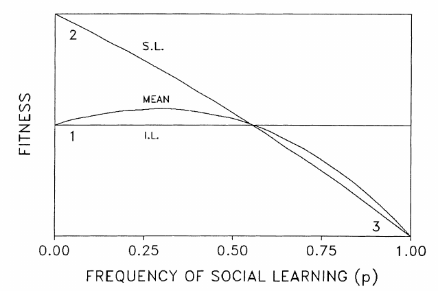

# Exploring impact of $k_y$, $k_z$ and $\sigma_s$ on strategies distribution 


```{r,include=F,eval=F}
exploreStrat=getAlllSummaries("ch14SexRepro")
exploreStrat=updateScale(exploreStrat)
save(file="data/exploreStratSex.bin",exploreStrat)
```

```{r,include=F}
load("data/exploreStrat.bin")
```

## With Random social Learning

### Trajectories

```{r,fig.width=10,fig.height=10}


    for( v in unique(exploreStrat$vt)){
        low=exploreStrat[ exploreStrat$vt == v & exploreStrat$k_y == .5 & exploreStrat$k_z == 2,]
        plotAllProp(low,m=0.2,E=0)
    }

```

### Final proportions

```{r,fig.width=10,fig.height=10,results='asis'}
kys=unique(exploreStrat$k_y)
kzs=unique(exploreStrat$k_z)
for( mu in unique(exploreStrat$mu)){
    cat(paste0("### Strategies proportion for mu = ",mu), sep="\n\r")
    par(mfrow=c(2,2),oma=c(1,1,1,1))
    for( v in unique(exploreStrat$vt)){
        for( sigma in unique(exploreStrat$sigma)){
            subset=exploreStrat[exploreStrat$sigma == sigma & exploreStrat$vt == v & exploreStrat$mu == mu,]

            propy=tapply(subset$prop_y, subset[,c("k_y","k_z")],quantile,na.rm=T)
            propz=tapply(subset$prop_z, subset[,c("k_y","k_z")],quantile,na.rm=T)
            kysu=1:length(kys)
    #par(mar=c(0,0,0,0))
            plot(1,1,type="n",ylim=c(0,1),xlim=range(kysu,kysu+3*.05),ylab="proportion of population",xlab=expression(k[y]),main=bquote(mu == .(mu) ~ sigma[s] == .(sigma) ~ vt == .(v)  ),xaxt="n")
            axis(1,at=kysu+0.1,label=kys)
            for(kz in 1:length(kzs)){
                ui=sapply(propy[,kz],"[",2:4)
                uz=sapply(propz[,kz],"[",2:4)
                arrows(kysu+(kz-1)*0.1,ui[1,],kysu+(kz-1)*0.1,ui[3,],col="red",angle=90,code=3,length=.05,lwd=2,lty=kz)
                arrows(kysu+(kz-1)*0.1,uz[1,],kysu+(kz-1)*0.1,uz[3,],col="green",angle=90,code=3,length=.05,lwd=2,lty=kz)
            }
            legend("topright",legend=c(paste("k_z=",kzs),"social","individual"),lty=c(1:3,1,1),col=c(1,1,1,"green","red"))
        }
    }
    cat("\n\r")
}

```

### Fitness wrt. Proportion of Social Learner

```{r}
par(mfrow=c(1,2))
exploreStrat$classZ=cut(exploreStrat$prop_z,breaks=10)
exploreStrat$classY=cut(exploreStrat$prop_y,breaks=10)
boxplot(exploreStrat$mean_w ~ exploreStrat$classY)
boxplot(exploreStrat$mean_w ~ exploreStrat$classZ)

```

### Extinction Time

```{r,fig.width=10,fig.height=10,results='asis'}
kys=unique(exploreStrat$k_y)
kzs=unique(exploreStrat$k_z)
for( mu in unique(exploreStrat$mu)){
    cat(paste0("### Extinction Time for mu = ",mu), sep="\n\r")
    par(mfrow=c(2,2))
    for( v in unique(exploreStrat$vt)){
        for( sigma in unique(exploreStrat$sigma)){
            subset=exploreStrat[exploreStrat$sigma == sigma & exploreStrat$vt == v & exploreStrat$mu == mu,]

            exct=tapply(subset$extinction, subset[,c("k_y","k_z")],quantile,na.rm=T)
            kysu=1:length(kys)
            plot(1,1,type="n",ylim=c(0,40000),xlim=range(kysu,kysu+3*.05),ylab="extinction time",xlab=expression(k[y]),main=bquote(mu == .(mu) ~ sigma[s] == .(sigma) ~ vt == .(v)  ),xaxt="n")
            axis(1,at=kysu+0.1,label=kys)
            for(kz in 1:length(kzs)){
                et=sapply(exct[,kz],"[",2:4)
                arrows(kysu+(kz-1)*0.1,et[1,],kysu+(kz-1)*0.1,et[3,],angle=90,code=3,length=.05,lwd=3,lty=kz)
            }
            legend("topright",legend=c(paste("k_z=",kzs)),lty=c(1:3),col=c(1,1,1))
        }
    }
    cat("\n\r")
}

```

## With Best social Learning

```{r,include=F,eval=F}
exploreStratBest=getAlllSummaries("bestSLS/")
exploreStratBest=updateScale(exploreStratBest)
save(file="data/exploreStratBest.bin",exploreStratBest)
```

```{r,include=F}
load("data/exploreStratBest.bin")
```

### Trajectories

```{r,fig.width=10,fig.height=10}


    for( v in unique(exploreStratBest$vt)){
        low=exploreStratBest[ exploreStratBest$vt == v & exploreStratBest$k_y == .5 & exploreStratBest$k_z == 2,]
        plotAllProp(low,m=0.2,E=0)
    }

```

### Final proportions

```{r,fig.width=10,fig.height=10,results='asis'}
kys=unique(exploreStratBest$k_y)
kzs=unique(exploreStratBest$k_z)
for( mu in unique(exploreStratBest$mu)){
    cat(paste0("### Strategies proportion for mu = ",mu), sep="\n\r")
    par(mfrow=c(2,2))
    for( v in unique(exploreStratBest$vt)){
        for( sigma in unique(exploreStratBest$sigma)){
            subset=exploreStratBest[exploreStratBest$sigma == sigma & exploreStratBest$vt == v & exploreStratBest$mu == mu,]

            propy=tapply(subset$prop_y, subset[,c("k_y","k_z")],quantile,na.rm=T)
            propz=tapply(subset$prop_z, subset[,c("k_y","k_z")],quantile,na.rm=T)
            kysu=1:length(kys)
            plot(1,1,type="n",ylim=c(0,1),xlim=range(kysu,kysu+3*.05),ylab="proportion of population",xlab=expression(k[y]),main=bquote(mu == .(mu) ~ sigma[s] == .(sigma) ~ vt == .(v)  ),xaxt="n")
            axis(1,at=kysu+0.1,label=kys)
            for(kz in 1:length(kzs)){
                ui=sapply(propy[,kz],"[",2:4)
                uz=sapply(propz[,kz],"[",2:4)
                arrows(kysu+(kz-1)*0.1,ui[1,],kysu+(kz-1)*0.1,ui[3,],col="red",angle=90,code=3,length=.05,lwd=2,lty=kz)
                arrows(kysu+(kz-1)*0.1,uz[1,],kysu+(kz-1)*0.1,uz[3,],col="green",angle=90,code=3,length=.05,lwd=2,lty=kz)
            }
            legend("topright",legend=c(paste("k_z=",kzs),"social","individual"),lty=c(1:3,1,1),col=c(1,1,1,"green","red"))
        }
    }
    cat("\n\r")
}

```

### Fitness wrt. Proportion of Social Learner

```{r}
par(mfrow=c(1,2))
exploreStratBest$classZ=cut(exploreStratBest$prop_z,breaks=10)
exploreStratBest$classY=cut(exploreStratBest$prop_y,breaks=10)
boxplot(exploreStratBest$mean_w ~ exploreStratBest$classY)
boxplot(exploreStratBest$mean_w ~ exploreStratBest$classZ)

```

### Extinction Time

```{r,fig.width=10,fig.height=10,results='asis'}
kys=unique(exploreStratBest$k_y)
kzs=unique(exploreStratBest$k_z)
for( mu in unique(exploreStratBest$mu)){
    cat(paste0("### Extinction Time for mu = ",mu), sep="\n\r")
    par(mfrow=c(2,2))
    for( v in unique(exploreStratBest$vt)){
        for( sigma in unique(exploreStratBest$sigma)){
            subset=exploreStratBest[exploreStratBest$sigma == sigma & exploreStratBest$vt == v & exploreStratBest$mu == mu,]

            exct=tapply(subset$extinction, subset[,c("k_y","k_z")],quantile,na.rm=T)
            kysu=1:length(kys)
            plot(1,1,type="n",ylim=c(0,40000),xlim=range(kysu,kysu+3*.05),ylab="extinction time",xlab=expression(k[y]),main=bquote(mu == .(mu) ~ sigma[s] == .(sigma) ~ vt == .(v)  ),xaxt="n")
            axis(1,at=kysu+0.1,label=kys)
            for(kz in 1:length(kzs)){
                et=sapply(exct[,kz],"[",2:4)
                arrows(kysu+(kz-1)*0.1,et[1,],kysu+(kz-1)*0.1,et[3,],angle=90,code=3,length=.05,lwd=3,lty=kz)
            }
            legend("topright",legend=c(paste("k_z=",kzs)),lty=c(1:3),col=c(1,1,1))
        }
    }
    cat("\n\r")
}

```

## Compare Random and Best

### Proportion of Learner vs fitness

```{r}
par(mfrow=c(1,2))
best=tapply(exploreStratBest$mean_w,exploreStratBest$classY,mean)
random=tapply(exploreStrat$mean_w,exploreStrat$classY,mean)
bestsd=tapply(exploreStratBest$mean_w,exploreStratBest$classY,sd)
randomsd=tapply(exploreStrat$mean_w,exploreStrat$classY,sd)
plot(1,1,ylim=c(0,1),xlim=c(1,10),type="n",main="proportion of individual learner",xlab="prop pure Y",ylab="mean w",xaxt="n")
lines(best,col="red",lwd=2)
#lines(best-bestsd,col="red",lty=3)
lines(random,col="black",lwd=2)
#lines(random-randomsd,col="blue",lty=3)
axis(1,at=seq(1,10,length.out=5),label=seq(0,1,length.out=5))
legend("bottomright",legend=c("random","best"),col=c("black","red"),lwd=2)

best=tapply(exploreStratBest$mean_w,exploreStratBest$classZ,mean)
random=tapply(exploreStrat$mean_w,exploreStrat$classZ,mean)
bestsd=tapply(exploreStratBest$mean_w,exploreStratBest$classZ,sd)
randomsd=tapply(exploreStrat$mean_w,exploreStrat$classZ,sd)
plot(1,1,ylim=c(0,1),xlim=c(1,10),type="n",main="proportion of social learner",xlab="prop pure Z",ylab="mean w",xaxt="n")
lines(best,col="red",lwd=2)
#lines(best-bestsd,col="red",lty=3)
lines(random,col="black",lwd=2)
#lines(random-randomsd,col="blue",lty=3)
axis(1,at=seq(1,10,length.out=5),label=seq(0,1,length.out=5))
```


In comparison with [Rogers 1988](https://anthrosource.onlinelibrary.wiley.com/doi/epdf/10.1525/aa.1988.90.4.02a00030), Figure 1:


### Extinction Time 

```{r,fig.width=10,fig.height=10,results='asis'}
kys=unique(exploreStrat$k_y)
kzs=unique(exploreStrat$k_z)
for( mu in unique(exploreStrat$mu)){
    cat(paste0("### Extinction Time for mu = ",mu), sep="\n\r")
    par(mfrow=c(2,2))
    for( v in unique(exploreStrat$vt)){
        for( sigma in unique(exploreStrat$sigma)){
            subset=exploreStrat[exploreStrat$sigma == sigma & exploreStrat$vt == v & exploreStrat$mu == mu,]
            subsetBest=exploreStratBest[exploreStratBest$sigma == sigma & exploreStratBest$vt == v & exploreStratBest$mu == mu,]

            exct=tapply(subset$extinction, subset[,c("k_y","k_z")],quantile,na.rm=T)
            exctBest=tapply(subsetBest$extinction, subsetBest[,c("k_y","k_z")],quantile,na.rm=T)
            kysu=1:length(kys)
            plot(1,1,type="n",ylim=c(0,40000),xlim=range(kysu,kysu+3*.05),ylab="expression Time",xlab=expression(k[y]),main=bquote(mu == .(mu) ~ sigma[s] == .(sigma) ~ vt == .(v)  ),xaxt="n")
            axis(1,at=kysu+0.1,label=kys)
            for(kz in 1:length(kzs)){
                et=sapply(exct[,kz],"[",2:4)
                etB=sapply(exctBest[,kz],"[",2:4)
                arrows(kysu+(kz-1)*0.1,et[1,],kysu+(kz-1)*0.1,et[3,],angle=90,code=3,length=.05,lwd=3,lty=kz)
                arrows(kysu+(kz-1)*0.1,etB[1,],kysu+(kz-1)*0.1,etB[3,],angle=90,code=3,length=.05,lwd=3,lty=kz,col="red")
            }
            legend("topright",legend=c(paste("k_z=",kzs),"random","best"),lty=c(1:3,1,1),col=c(1,1,1,1,"red"))
        }
    }
    cat("\n\r")
}

```

